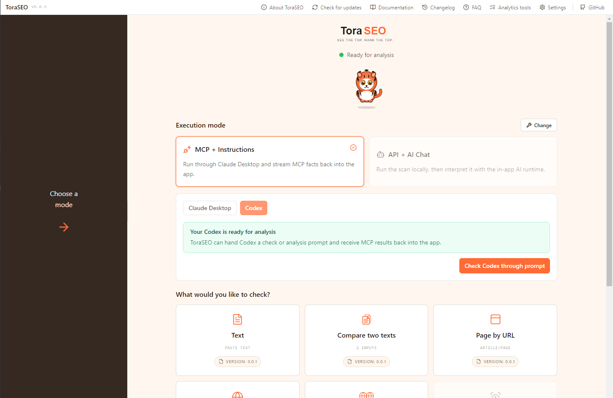
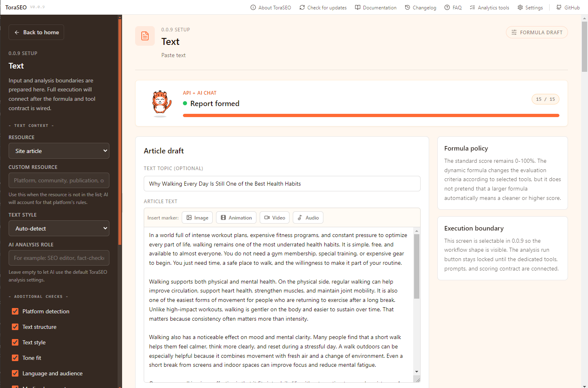
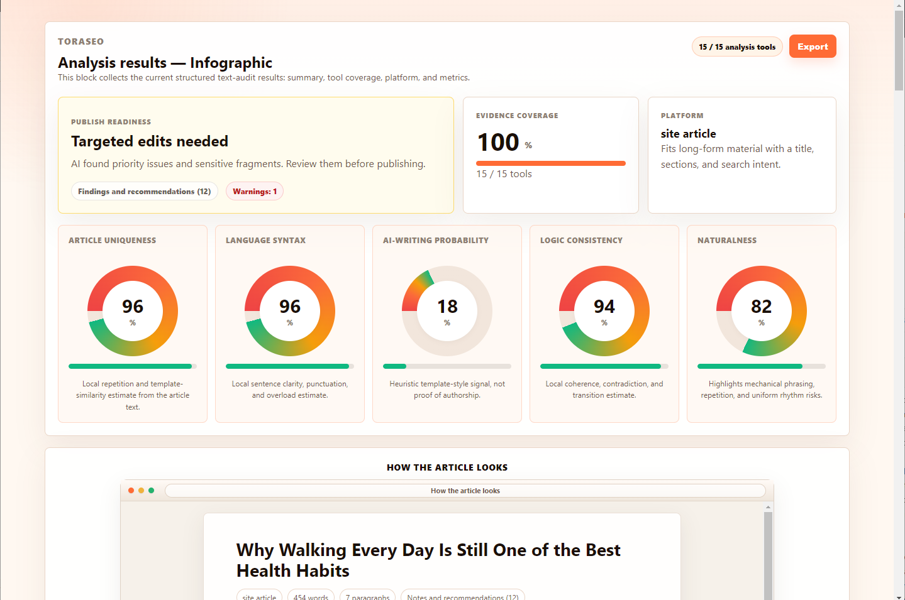
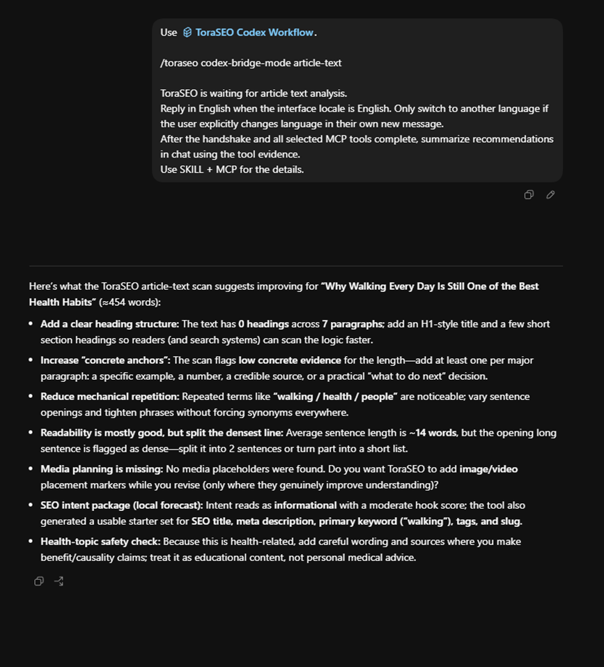
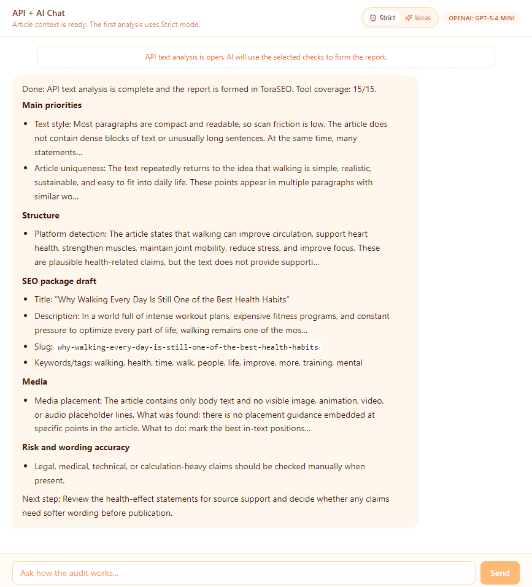

<div align="center">

<picture>
  <source media="(prefers-color-scheme: dark)" srcset="https://raw.githubusercontent.com/Magbusjap/toraseo/main/branding/logos/tora-logo-horizontal-dark.svg">
  
</picture>

**Open-source SEO analysis workspace for audits, AI review, and structured reports**

[](LICENSE)
[](https://github.com/Magbusjap/toraseo/releases)
[](https://claude.ai)
[](https://openai.com/codex/)

[](https://github.com/Magbusjap/toraseo/releases)
[](https://github.com/Magbusjap/toraseo/releases)
[](https://github.com/Magbusjap/toraseo/releases)

<p>
  <strong>Language:</strong> English | <a href="README.ru.md">Russian</a>
</p>

</div>

---

<p align="center">
  
</p>

<div align="center">

### Explore what SEO analysis can become

ToraSEO turns technical checks, AI interpretation, and visual reporting into one calm desktop workflow. Start with a URL or article text, choose how the AI should work, and get evidence-backed recommendations you can act on.

</div>

## Why ToraSEO

ToraSEO is built for people who need more than a raw crawler output, but less chaos than a pile of disconnected SEO tools. It combines:

- a desktop app for analysis setup, progress, reports, and exports
- an MCP server that runs structured checks and sends evidence back to the app
- Claude Desktop and Codex instruction packages for guided external AI workflows
- an in-app `API + AI Chat` path for provider-backed analysis inside ToraSEO

The goal is simple: help you see what is weak, what is strong, and what to fix first.

## Product Preview

<table>
  <tr>
    <td width="50%" valign="top">
      
      <br>
      <strong>Prepare the analysis</strong>
      <br>
      Paste an article, choose the context, and select the checks that matter for the current audit.
    </td>
    <td width="50%" valign="top">
      
      <br>
      <strong>Read the report visually</strong>
      <br>
      Turn scan evidence into a compact dashboard with readiness, coverage, metrics, and recommendations.
    </td>
  </tr>
</table>

## Two Ways To Work

<table>
  <tr>
    <td width="50%" valign="top">
      
      <br>
      <strong>MCP + Instructions mode</strong>
      <br>
      Run structured checks through Codex or Claude Desktop. The external AI client calls ToraSEO MCP tools, then the app receives structured results.
    </td>
    <td width="50%" valign="top">
      
      <br>
      <strong>API + AI Chat mode</strong>
      <br>
      Run the analysis inside ToraSEO with your configured provider and model, then review the findings in the built-in chat and report.
    </td>
  </tr>
</table>

## What Tora Helps With

<table>
  <tr>
    <td width="90" align="center" valign="top">
      
    </td>
    <td valign="top">
      <strong>Start from a clear audit path.</strong>
      <br>
      ToraSEO helps you choose the right analysis mode before the scan begins, so the report is focused instead of overloaded.
    </td>
  </tr>
  <tr>
    <td width="90" align="center" valign="top">
      
    </td>
    <td valign="top">
      <strong>Find weak spots without guessing.</strong>
      <br>
      The app separates deterministic scan facts from AI interpretation, making recommendations easier to trust and verify.
    </td>
  </tr>
  <tr>
    <td width="90" align="center" valign="top">
      
    </td>
    <td valign="top">
      <strong>Move from findings to next steps.</strong>
      <br>
      Reports are designed to answer what matters first: what is broken, what is promising, and what should be improved next.
    </td>
  </tr>
  <tr>
    <td width="90" align="center" valign="top">
      
    </td>
    <td valign="top">
      <strong>Build toward stronger search visibility.</strong>
      <br>
      ToraSEO is preparing the ground for Tora Rank: a clearer way to compare quality, readiness, and competitive gaps over time.
    </td>
  </tr>
</table>

## Current Analysis Areas

The current public direction covers five analysis families:

| Analysis | What it is for |
|---|---|
| **Text** | Article quality, structure, readability, AI-style signals, SEO packaging, and risk flags |
| **Compare two texts** | Text A/B comparison, content gaps, similarity risk, style differences, and improvement plans |
| **Page by URL** | Page text extraction plus article-style checks for a specific URL |
| **Site by URL** | Technical and on-page audit checks for a single website |
| **Site comparison by URL** | A compact competitive dashboard for up to three websites |

Some areas are still marked as in development inside the app. The public roadmap is intentionally careful: ToraSEO should show useful evidence first, then layer scoring and ranking logic on top.

## Quick Start

Choose the path that matches your workflow.

### Desktop App

Best for users who want the visual workspace and either runtime path:

1. Download the latest release from [GitHub Releases](https://github.com/Magbusjap/toraseo/releases).
2. Install the desktop app.
3. Choose `MCP + Instructions` or `API + AI Chat` on the home screen.
4. If you use `API + AI Chat`, configure your provider and model in Settings.

### MCP Server

Best for users who want the tool layer directly:

```bash
git clone https://github.com/Magbusjap/toraseo.git
cd toraseo/mcp
npm install
npm run build
```

Then register the server in your MCP-compatible client:

```json
{
  "mcpServers": {
    "toraseo": {
      "command": "node",
      "args": ["/absolute/path/to/toraseo/mcp/dist/index.js"]
    }
  }
}
```

Full setup details live in [mcp/README.md](mcp/README.md).

### Claude And Codex Workflows

Best for users who want guided audit runs inside an AI client:

| Workflow | Entry point |
|---|---|
| **Claude Bridge Instructions** | [claude-bridge-instructions/README.md](claude-bridge-instructions/README.md) |
| **Codex Workflow Instructions** | [toraseo-codex-workflow/README.md](toraseo-codex-workflow/README.md) |

Download the ZIP assets from the unified [Releases page](https://github.com/Magbusjap/toraseo/releases). Do not use auto-generated source archives for installation.

## What Is In This Repo

ToraSEO is a multi-surface repository. Several folders are independently useful entry points, so they keep their own README files.

| Surface | Purpose | Entry point |
|---|---|---|
| **Root repo** | Product overview, release status, documentation map | [README.md](README.md) |
| **Desktop app** | Native UI, bridge mode, provider settings, reports | [app/README.md](app/README.md) |
| **MCP server** | Tool execution layer for scans and bridge data | [mcp/README.md](mcp/README.md) |
| **Claude Bridge Instructions** | Claude-side setup and workflow package | [claude-bridge-instructions/README.md](claude-bridge-instructions/README.md) |
| **Codex Workflow Instructions** | Codex-side setup and bridge workflow package | [toraseo-codex-workflow/README.md](toraseo-codex-workflow/README.md) |
| **QA docs** | Manual checks and smoke-test support | [qa/README.md](qa/README.md) |

## Architecture

ToraSEO is designed so each layer stays independently useful:

- **App:** status, setup, progress, reports, exports, and native AI chat
- **MCP server:** scan execution and structured bridge data
- **Instruction packages:** Claude-side and Codex-side workflow orchestration

Three principles drive the design:

1. **Evidence first:** deterministic scan facts come before model interpretation.
2. **Composable surfaces:** app, MCP, and instruction packages can be used together or separately.
3. **Explicit trust boundaries:** provider secrets, bridge handshakes, and approval flows stay visible.

For deeper design rationale, see [docs/ARCHITECTURE.md](docs/ARCHITECTURE.md).

## Current Limits

These are current product boundaries, not hidden promises:

- ToraSEO does not replace Search Console, Yandex Webmaster, backlink providers, or full rank trackers.
- It does not claim live SERP visibility, clicks, impressions, or popularity without an official connected source.
- AI-writing probability and AI trace signals are editing heuristics, not proof of authorship.
- Tora Rank is a future direction, not a finished public scoring system in this release.

## Documentation Map

- [Documentation hub](docs/README.md)
- [FAQ](docs/FAQ.md)
- [App README](app/README.md)
- [MCP README](mcp/README.md)
- [Claude Bridge Instructions README](claude-bridge-instructions/README.md)
- [Codex Workflow Instructions README](toraseo-codex-workflow/README.md)
- [Architecture overview](docs/ARCHITECTURE.md)
- [Model compatibility notes](docs/MODEL_COMPATIBILITY.md)
- [Crawling policy](CRAWLING_POLICY.md)
- [Security policy](SECURITY.md)
- [Changelog](CHANGELOG.md)

## Contributing

The fastest ways to help right now:

- Star the repository
- Open an issue with product feedback, bugs, or workflow friction
- Run a real audit and share what worked or broke
- Report security issues privately per [SECURITY.md](SECURITY.md)

Formal contribution guidance can expand later, but practical feedback and targeted fixes are already welcome.

## License

Licensed under the [Apache License 2.0](LICENSE).

---

<div align="center">

**Built by [@Magbusjap](https://github.com/Magbusjap)** |
[Report issue](https://github.com/Magbusjap/toraseo/issues) |
[Security policy](SECURITY.md) |
[Latest release](https://github.com/Magbusjap/toraseo/releases)

</div>
